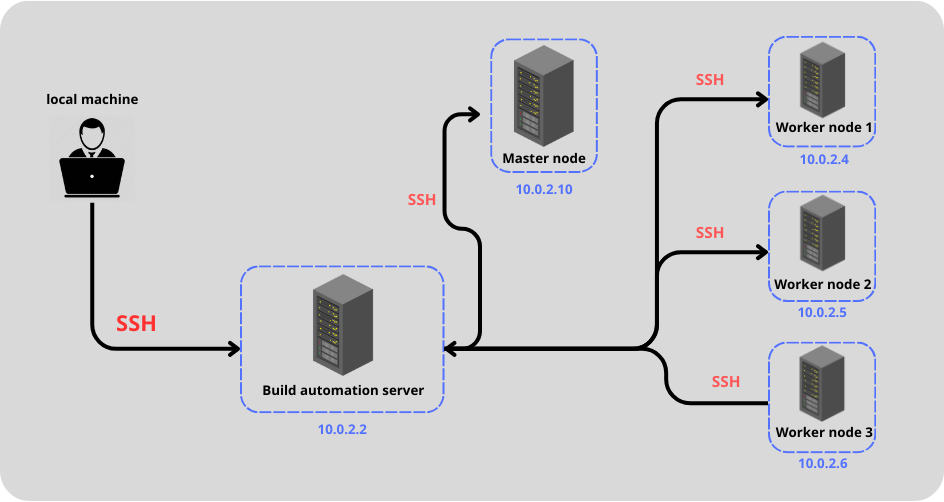

# kubernetes-azure0


## Name
Creating and configuring a kubernetes cluster from scratch on azure platform

## Description
This project aims to create and configure a kubernetes cluster on the cloud from scratch (the same principle can be applied in an on-premises infrastructure without needing a kubernetes service), so in this project you'll learn how to manage kubernetes components and understand more about kubernetes architecture and tools.

## Project components and files + detailed description
**main.tf file:** this file creates the desired infrastructure on the cloud (here, Azure). 

**my-playbook.yaml:** is an ansible playbook, this file is used to make some initial configurations in the infrastructure (such as installing the nginx web server to test whether the servers are reachable).

**hosts:** is an inventory of ansible hosts, this file contains server groups and is used by ansible to find out the configurations linked to each host.

**kubernetes.yaml:** is an ansible playbook, containing all the configurations needed to set up the cluster.

**infrastructure:** 

this infrastructure contains 5 servers: 

- build-automation-server: the main purpose of this server is to host an instance of a ci/cd tool like Jenkins, and it is responsible for deploying the application in the Kubernetes cluster. its ip address in the subnet is: 10.0.2.9 . 
This server also acts as an ssh bridge for the entire cluster.

- worker-nodes: there are three worker nodes in the Kubernetes cluster. their ip addresses in the subnet are: 10.0.2.4 ; 10.0.2.5 ; 10.0.2.6 .


- master-nodes: there is only one master node in the cluster. its ip address in the subnet is: 10.0.2.10 .

## Visuals
**Architecture:**


**Remote connection to hosts:**

- to remotely connect to the server, you can ssh to the build automation server, then ssh to any server in the cluster (the automation node server acts as an ssh bridge, sharing its public key between servers in the cluster).



## Usage
**Step 1:**

- clone the repository on your local machine.

**Step 2:**

- change the variables in the .env file. 

**Step 3:**

- change the paths of the ssh public key in the ansible playbook my-playbook.yaml and the hosts file so that it works with your .env variables.

**Step 4:**

- run terraform commands inside the repository root directory.
```shell
$ terraform init 
$ terraform apply --auto-approve
```

**Step 5:**

- you can now ssh to the master node machine and run kubectl to verify the execution.
 ```shell
$ kubectl get nodes
```
## Support

- for help contact me on my email address : tbn.khalil@gmail.com 

## Roadmap

In future versions of this project, I'd like to better organize the environment variables and their distribution in the configuration files (ansible playbooks, hosts inventory and terraform files). In addition, I need to find a better solution for sharing the build automation server's rsa public key among the cluster's nodes for ssh connections.

## Project status

**active**
